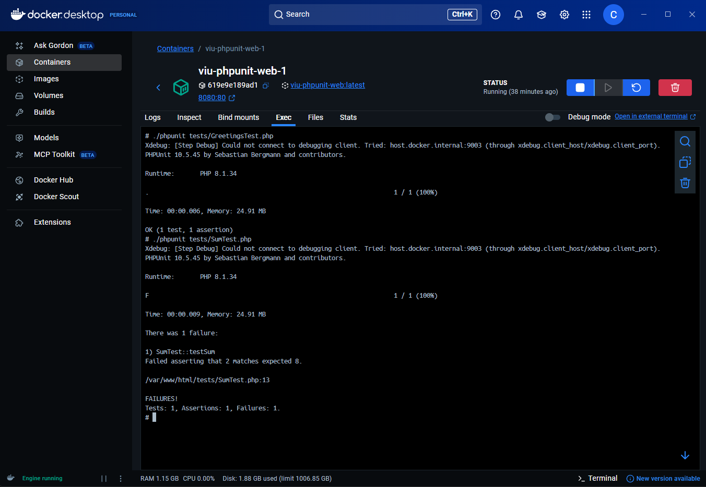

# ADS-306 | Práctica 1 - Primeros pasos en DevOps

Esta actividad es una introducción práctica a la Integración y Entrega Continuas (CI/CD) utilizando PHP, Docker y GitHub Actions.

## Datos del estudiante

**Nombre:** Jorge Daniel Choque Ferrufino  
**Carrera:** Sistemas Informaticos  
**Materia:** Analisis y Diseño de Sistemas II

## Captura de test unitarios en local

