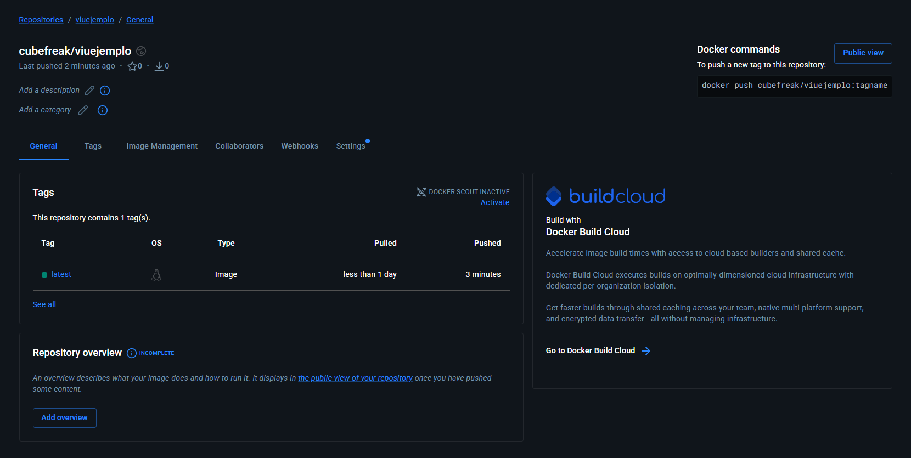
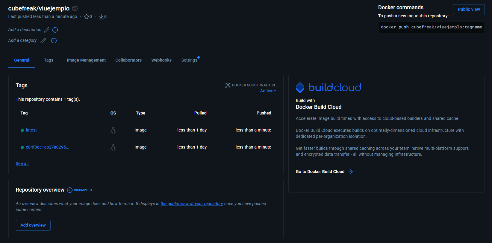

# ADS-306 | Práctica 1 - Primeros pasos en DevOps

Esta actividad es una introducción práctica a la Integración y Entrega Continuas (CI/CD) utilizando PHP, Docker y GitHub Actions.

## Datos del estudiante

**Nombre:** Jorge Daniel Choque Ferrufino  
**Carrera:** Sistemas Informaticos  
**Materia:** Analisis y Diseño de Sistemas II

## Captura de test unitarios en local

## Captura de las pruebas automatizadas en la nube

*<small>El job `ci` se ejecutó de manera exitosa tras realizar un push al repositorio y al inspeccionar los logs de GitHub Actions, se observa la ejecución de PHPUnit (`testdox`). Las pruebas implementadas pasan correctamente, mientras que las pendientes de desarrollo son detectadas como "risky", confirmando que el entorno de CI audita el código correctamente.</small>*

## Captura del despliegue de la imagen en Docker Hub (CD)

*<small>Tras superar la fase de integración (CI), el job `cd` construyó automáticamente la imagen de la aplicación y la subió con éxito al registro de Docker Hub con la etiqueta `latest`.</small>*

## Captura del despliegue con versionado específico (Git SHA)

Al utilizar un pipeline de CD más avanzado, la imagen no solo se etiqueta como la última disponible, sino que se vincula directamente al historial de control de versiones.

*<small>El pipeline construyó y subió la imagen con dos etiquetas: `latest` y el identificador único del commit (Git SHA). Esta práctica permite un control de versiones estricto, facilitando la trazabilidad y la opción de revertir a versiones anteriores exactas del código si fuera necesario.</small>*