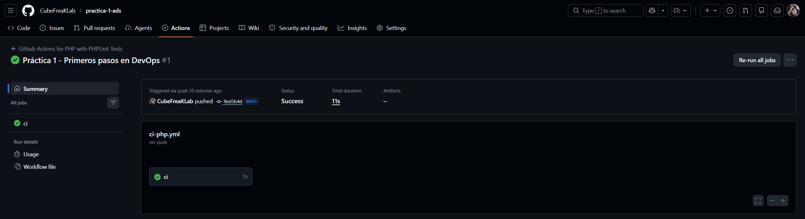
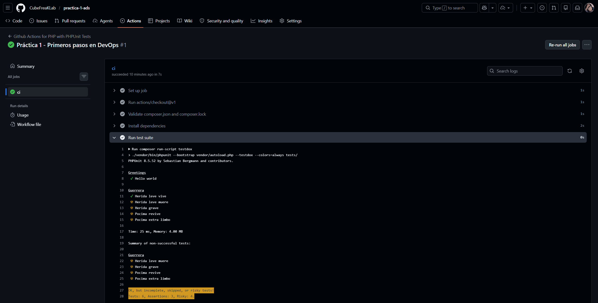

# ADS-306 | Práctica 1 - Primeros pasos en DevOps

Esta actividad es una introducción práctica a la Integración y Entrega Continuas (CI/CD) utilizando PHP, Docker y GitHub Actions.

## Datos del estudiante

**Nombre:** Jorge Daniel Choque Ferrufino  
**Carrera:** Sistemas Informaticos  
**Materia:** Analisis y Diseño de Sistemas II

## Captura de test unitarios en local

## Captura de las pruebas automatizadas en la nube

*<small>El job `ci` se ejecutó de manera exitosa tras realizar un push al repositorio y al inspeccionar los logs de GitHub Actions, se observa la ejecución de PHPUnit (`testdox`). Las pruebas implementadas pasan correctamente, mientras que las pendientes de desarrollo son detectadas como "risky", confirmando que el entorno de CI audita el código correctamente.</small>*
